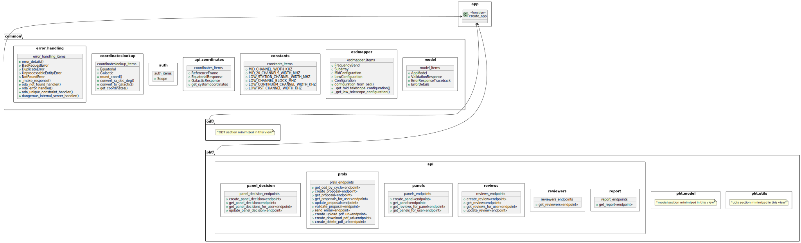
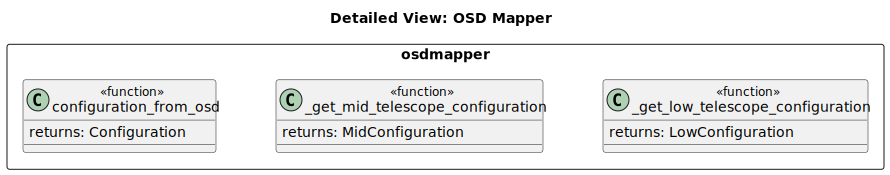
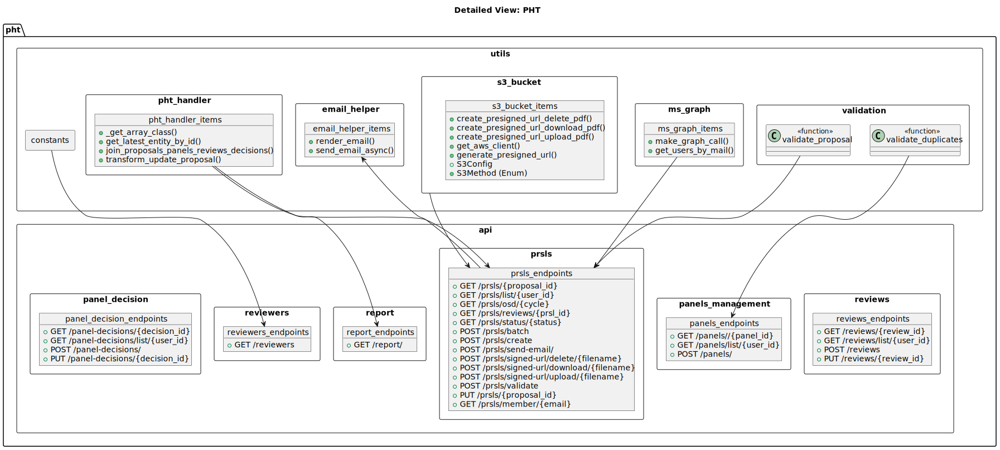

.. _module_view:

Module View
============

.. note::
   The current module view is a work in progress and will be updated as the
   project evolves and when a final structure is established and agreed upon.

The module view in the oso-services provides a high-level overview of the main components of the oso-services and major interactions between them. Detailed view 
module views of the osdmapper and pht and are also provided in specialised views. 

The module view of the 'pht' shows interactions for the proposals, proposal management and associated modules.

   High level module view diagram of the oso-services

   Module View Diagram of the OsdMapper

   Module View Diagram of the PHT