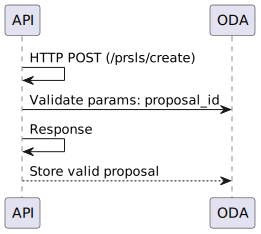
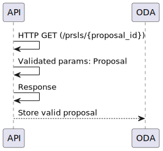
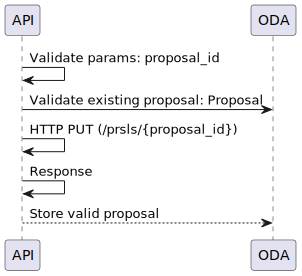
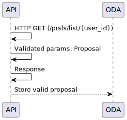
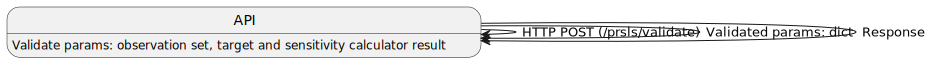
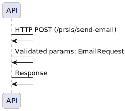
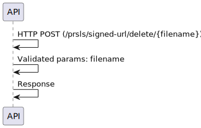

.. _prsl:

Create Proposal 
===================

Sequence diagram function flow when calling create proposal endpoint /prsls/create

Retrieve Proposals 
===================
Sequence diagram function flow when calling retrieve proposal endpoint /prsls/{proposal_id}

Edit Proposal
===============
Sequence diagram function flow when calling edit proposal endpoint /prsls/{proposal_id}

Retrieve list of Proposals 
===========================
Sequence diagram function flow when calling get list of proposals endpoint /prsls/list/{user_id}

Validate Proposal
==================
Sequence diagram function flow when calling validate proposal endpoint /prsls/validate

Email invite
=============
Sequence diagram function flow when calling email invite endpoint /prsls/send-email

Generate presigned S3 upload URL
=================================
Sequence diagram function flow when calling email invite endpoint /prsls/signed-url/upload/{filename}

Generate presigned S3 download URL
===================================
Sequence diagram function flow when calling email invite endpoint /prsls/signed-url/download/{filename}

Generate presigned S3 delete URL
=================================
Sequence diagram function flow when calling email invite endpoint /prsls/signed-url/delete/{filename}

